<div align = "center">
  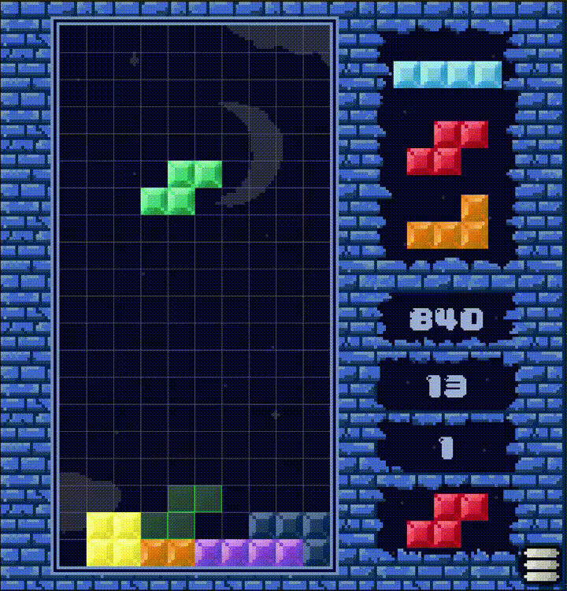
</div>
<div id="top"></div>


<div align="center">

# TETRIS-GAME

<em>Fun, classic retro game!</em>

<!-- BADGES -->


</div>

---

## Table of Contents

- [Overview](#overview)
- [Getting Started](#getting-started)
  - [Windows](#windows)
  - [Linux](#linux)
    - [Prerequisites](#prerequisites)
    - [Installation](#installation)
  - [Usage](#usage)
  - [Testing](#testing)
- [Project Structure](#project-structure)
- [Features](#features)
- [Contributing](#contributing)
- [About](#about)

---

## Overview

**Tetris-game** is a modern take on the classic Tetris game, developed in the *C++* language using *SDL2*, a low-level multimedia library. This project offers an open source code with a lot of fun, fancy [features](#features)!

### Key Features

- 🎮 **Gameplay Mechanics:** Swap figures, fast drop, visualize next figures and more!
- ⏱️ **Scene management:** Multiple scenes: Settings, opening scene, loose scene...
- 🛠️ **Sounds and Music:** With volume control, media player UI and a log to choose songs.
- 🌌 **Retro styling:** Self-made pixel art textures, fonts and others.
- ✍️ **Keybind mapping:** Keybinds can be changed for a better experience.
- ↩️ **Many more:** Play to try all the features!

---

## Getting Started

### Windows

To run the program on Windows, simply go to 

and download the latest version for Windows. Be sure to download the **whole** folder.
Inside you will find the aplication (.exe) with the name
```bash
tetris
```

### Linux

#### Prerequisites

Before building and running the game, make sure you have:

- **OS:** Ubuntu 20.04+ (or similar Linux distro)
- **Compiler:** g++ (GCC) 9.3.0 or later
- **Libraries:** SDL2, SDL2_ttf, SDL_Image, SDL_Mixer

#### Installation
To run the program, follow the next steps in order inside your terminal:

To install the required libraries and programs on Ubuntu:

```bash
sudo apt update
sudo apt install build-essential libsdl2-dev libsdl2-image-dev libsdl2-ttf-dev libsdl2-mixer-dev
```

To clone the repo locally:
```bash
git clone https://github.com/NicolasSerranoGarcia/Tetris-game.git
cd Tetris-game
```

To compile the game into an executable:
```bash
make
```
Note: The executable will be named "tetris" and will be located on the repo clone

To run the game:
```bash
./tetris
```

### Usage

This project is **open source**, and by no means it is aimed to benefit me in any financial way! The motivation behind this project is solely a **desire to learn** and overcome new obstacles. Feel free to **fork** the project and make any changes you find useful. You can also contact me via any of my [socials](linktr.ee/NicolasSerrano) if you need any information related to the project. I'm open to talk!

### Testing

This project has **no** QA testing. Every aspect has been designed and implemented correctly, but things go off very easily. If you encounter any unexpected behavior during your gameplay, you can report it via any of the socials listed [here](linktr.ee/NicolasSerrano). You can also open a pull request if your goal is to fix it yourself. Please note that problems may arise if you try to execute this program outside of the requirements listed at the beginning. 

---

## Project Structure

The project follows a simple structure. A loop will run indefinitely until the program (window) is closed. Inside the loop, there are two main functions: 
- ***First***, the program checks all the **events** that have been triggered since the last loop run. Each event is taken care individually until there are no events left. 
- ***Then***, the program takes care of the **rendering** and the **logic**.
<!-- Insert the excalidraw schema and maybe a UML diagram-->
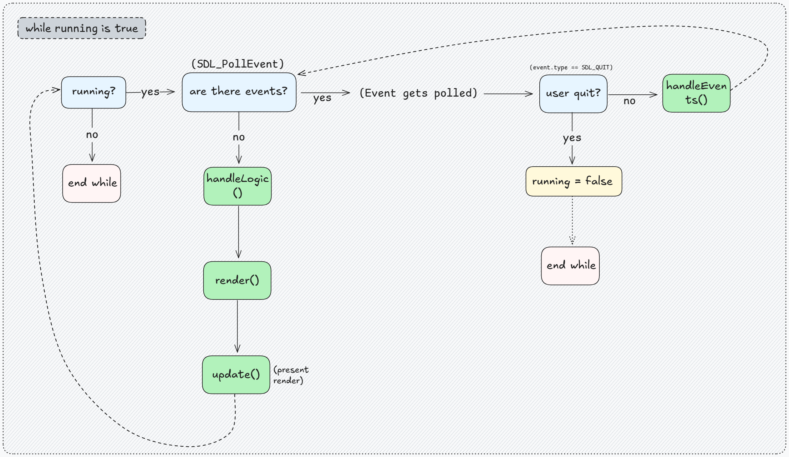

There are 4 different **scenes**. The user can change between scenes by pressing certain buttons, keys or loosing the game. The structure holds for each of the scenes, but each method will execute different code depending on which scene the program is on. There are auxiliary classes that use functionalities from SDL such as *Image*, *Font* or *Button*. Next is a UML diagram of the classes inside the program. The diagram doesn't show all the methods and attributes, only the essential ones for understanding the relationships.
<!-- Show a photo of each scene -->

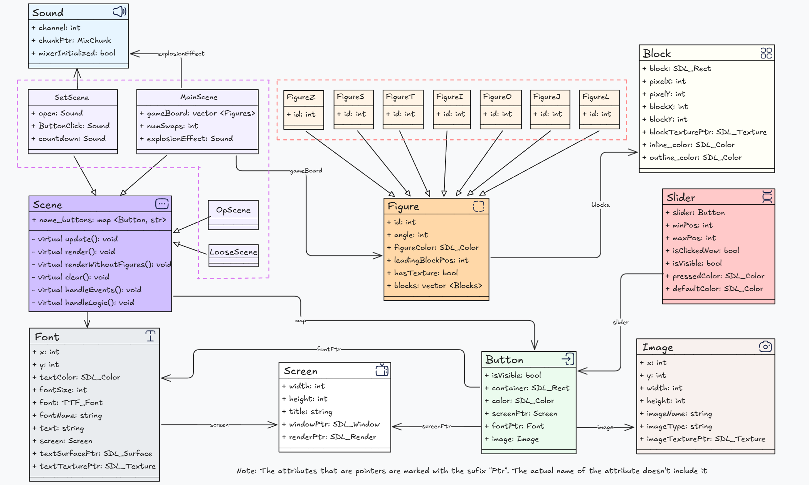

Additionally, auxiliary classes like *Button*, *Image* or *Font* can be loaded temporarily (not as an atributte) on any point of the code. These are not reflected in the diagram.

Every class is built to sustain the class Scene and it's childs. These classes can be used as a template for other SDL projects, so feel free to use them as you wish :). 

---

## Features

Here is a list of features and functionalities that enhance the user experience:

<!-- Do every gif or video as if you were a bot inside a tutorial of an official game (imagine fortnite or an installation guide gif) -->

- Distinct **scenes** that add ambient to the program: an *opening scene*, a *settings scene*, a *gameplay scene* and a *death scene*. The death scene lets you go to the opening scene, play again or open the settings.

<!--Inert photo of each scene -->
<div align = "center">
  
</div>

Gameplay features: 

- The next three figures to be played can be visualized while playing.
  
<!-- Insert a gif of using all the functionalities -->
<div align = "center">
  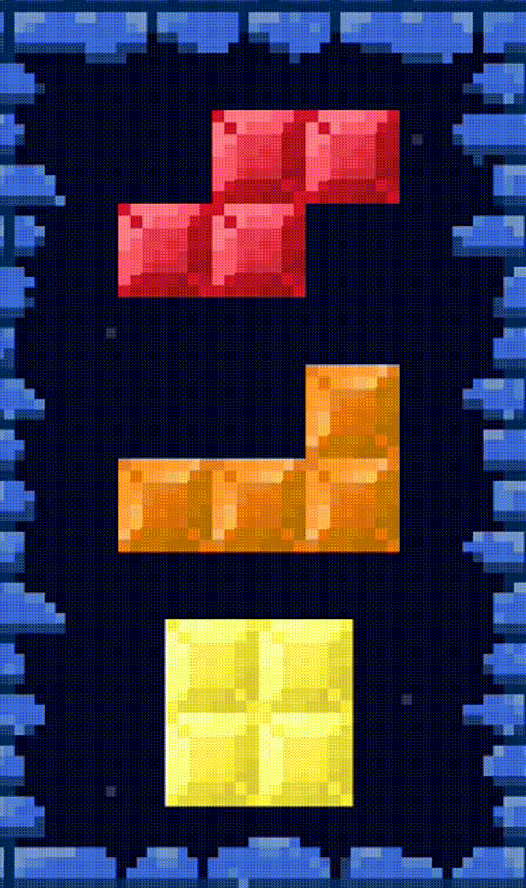
</div>
  
- A figure can be **swapped** with another saved previously

<!-- Insert a gif of using all the functionalities -->
<div align = "center">
  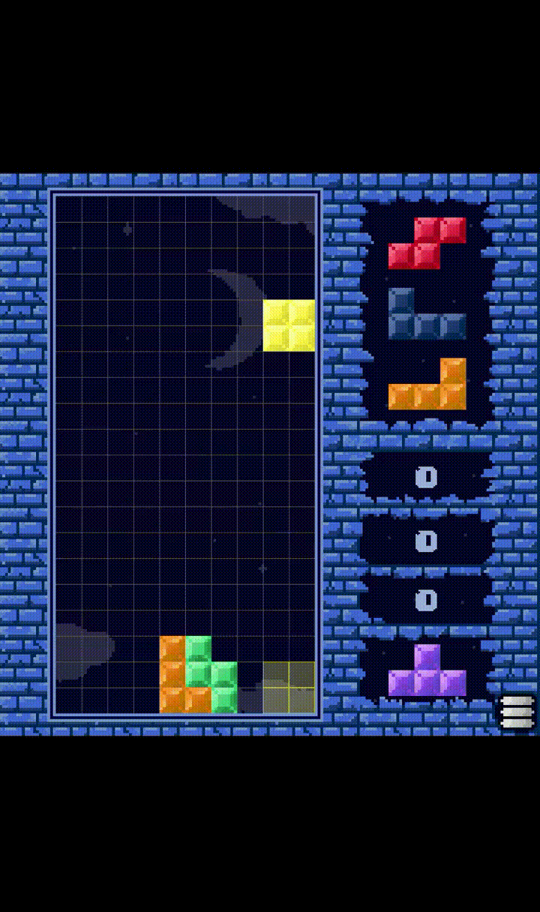
</div>

- A figure can be dropped to the bottom of the game board instantly (fast drop)
  
<!-- Insert a gif of using all the functionalities -->
<div align = "center">
  
</div>

- The figures can be **rotated** clockwise and anticlockwise

<!-- Insert a gif of using all the functionalities -->
<div align = "center">
  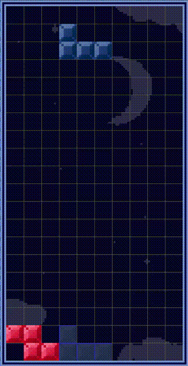
</div>

Miscellaneous features:

- The key binds associated with each action can be changed inside the settings. They are <ins>saved locally</ins>, so the next time the program is opened they are automatically loaded.

<!-- Insert a gif of changing the key binds, and maybe closing the program and opening it again to show -->
<div align = "center">
  
</div>

- There are **sound effects** and background **music**. The volume of both of them can be controlled inside the settings, using two sliders. There is also a radio used to skip, rewind and stop the music. There are 44 songs chosen randomly and automatically if the radio is ignored
<!-- Insert a video with audio of using the radio -->
<div align = "center">
  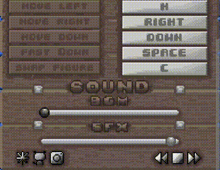
</div>

- There is a **slider** to scroll through the settings. The mouse wheel can also be used for this purpose
  
<!-- Insert gif of using the mouse wheel and the slider -->
<div align = "center">
  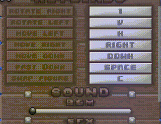
</div>

- There is a **countdown** that triggers when the settings is closed to let the user prepare to resume the game
  
<!-- show the countdown -->
<div align = "center">
  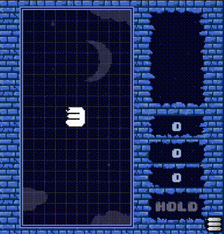
</div>
  

- The **stats** of the best game are shown in the opening scene. The top 5 is <ins>saved locally</ins>, so the program can be closed without loosing the progress

<!-- Show an example of this -->
<div align = "center">
  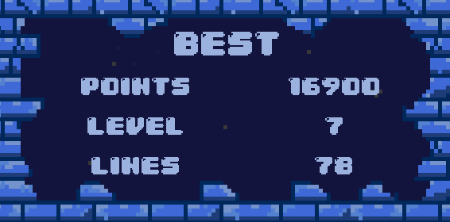
</div>

- My **main socials** are shown as **buttons** inside the settings. Clicking them will open a browser pop up redirecting to each

<!-- Show a gif clicking the buttons -->
<div align = "center">
  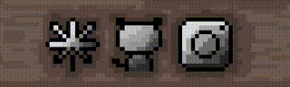
</div>

Here is a list of other (micro) features that further enhance the gameplay experience:


- Inside the settings, the buttons that are partially shown cannot be triggered on the zones that are not visible

<!-- show an example of pressing a button-->
<div align = "center">
  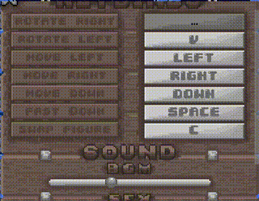
</div>

- When a key bind button is pressed, other buttons and sliders can **still** be triggered. The pressed button will still be waiting for a key to be pressed.

<!-- Show a gif of this -->
<div align = "center">
  
</div>

- When in the settings, the figures of the current gameplay are **not shown** to prevent cheating
  
<!-- Show an example of closing and opening the settings -->
<div align = "center">
  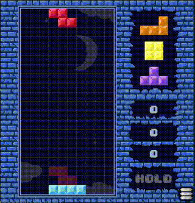
</div>

---

## Contributing

Thank you for considering contributing to this project!

Here’s a simple guide to help you get started:

### 1. Fork the repository

Click the **Fork** button at the top right of the page, then clone your fork locally:

```bash
git clone https://github.com/your-username/your-repo.git
cd your-repo
```

### 2. Create a new branch for your changes

```bash
git checkout -b my-feature-branch
```

### 3. Make your changes

Implement your changes. Please keep the code clean and follow the existing style if possible.

### 4. Test your changes

Make sure everything works as expected.  

### 5. Commit and push

```bash
git add .
git commit -m "Add feature: [your short description here]"
git push origin my-feature-branch
```

### 6. Open a Pull Request

Go to your fork on GitHub and click **"Compare & Pull Request"**.  
Provide a clear title and description of your changes.


### 💡 Not sure where to start?

Check the [issues page](#) and look for labels like `good first issue`.  
Feel free to open a discussion or issue if you have an idea or question!


You can also pick one task from 
```bash
./TODO
``` 
The unmarked ([], [/]) features have not been implemented (yet). Feel free to choose one and fork the project!

---

## About

I've always been fascinated by game creation—especially retro games like *Mario Bros* on the NES or *Mario 64*. It's incredible how much can be accomplished within the hardware limitations of those consoles. As a first-year Computer Engineering student, I'm glad I've taken courses in Assembly and Computer Architecture. They’ve allowed me to peek into the source code of these games without feeling overwhelmed.

**SDL (Simple DirectMedia Layer)** is a low-level multimedia library that provides control over fundamental components like event handling, window creation, and canvas drawing. While it's commonly used as a windowing layer for applications like OpenGL, SDL can function as a standalone module.  
> ⚠️ SDL is **not** a game engine.  
It only offers the bare tools you need to build something from scratch—what you do with them is entirely up to you.

Of course, writing a project in Assembly is very different from using SDL. SDL abstracts the process of accessing hardware directly (for input, drawing, etc.), but it brings you closer to the hardware than high-level engines. Creating this project has been a real challenge: it pushed me to think deeply about the core functionalities of a game like *Tetris* and to implement them in a way that feels natural and intuitive.

I'm aware that my code is far from perfect. It lacks proper design patterns and other architectural considerations—but I’m proud of what I’ve achieved. I encountered many obstacles, thought them through, and managed to overcome them.

Sure, I could’ve made a simple screen where you just play *Tetris*. But I wanted to go further. I wanted to create something personal—something where I could add features I find interesting or useful.

This project is recreational. It’s a learning journey, and I’ve truly enjoyed every part of it.  
I hope you enjoy what I’ve built and have fun with the gameplay experience. :)

---

Thanks for reading and enjoy this project!


